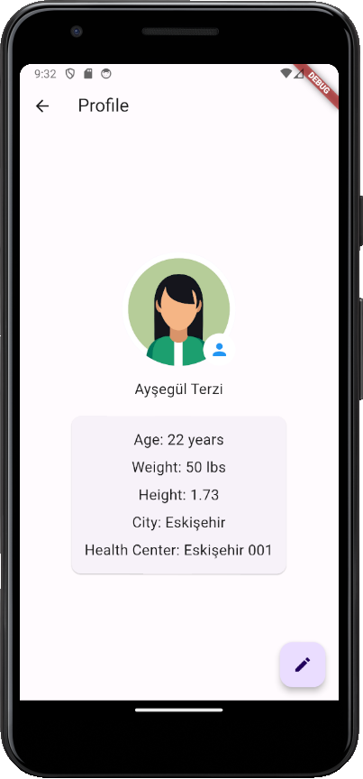
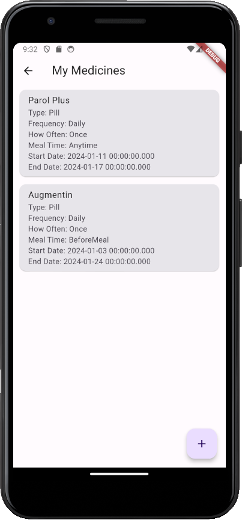
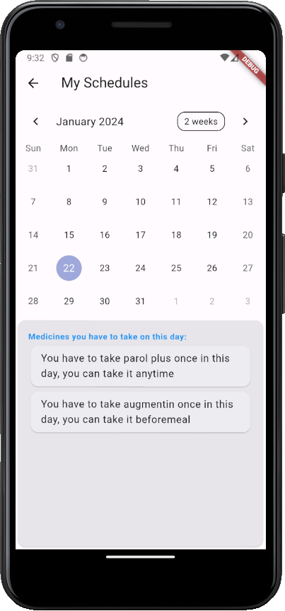
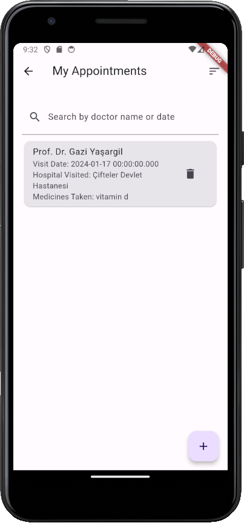

# Medication Assistant

This is a Flutter project.

## Main Objective

You've seen medication tracking apps, almost all of them can help you control your medication manually, but they don't promise you an automatic schedule. This is exactly what we aimed to do with this application. After you enter your medication, the way you use it, the frequency of use, the time you start and stop taking it, it creates an automatic schedule for you and makes your medication tracking easier. There are also pages where you can list and search your doctor appointments and take notes about your health status. 

There are many features that we aim to add to our app, one of them is an artificial intelligence that calculates the risk of heart attack based on your health status. 

#### You can easily run this project by entering the commands shown in the example below into your terminal:

```python
git clone https://github.com/AysegulTerzi/medication-assistant.git
flutter doctor
flutter run

```

 
 

If you have a suggestion for us, please feel free to share it !
* terziaysegul9696@gmail.com
* https://www.linkedin.com/in/aysegul-terzi/

